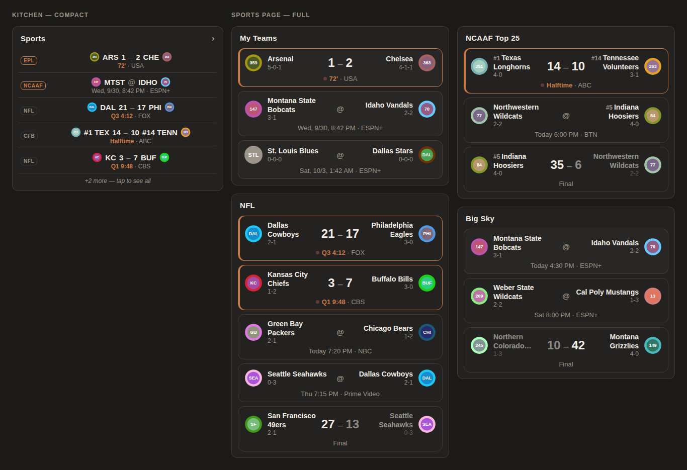
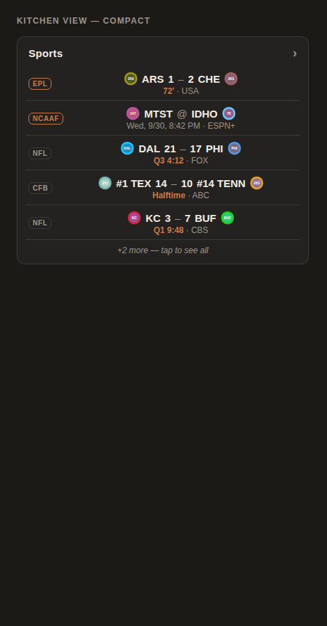
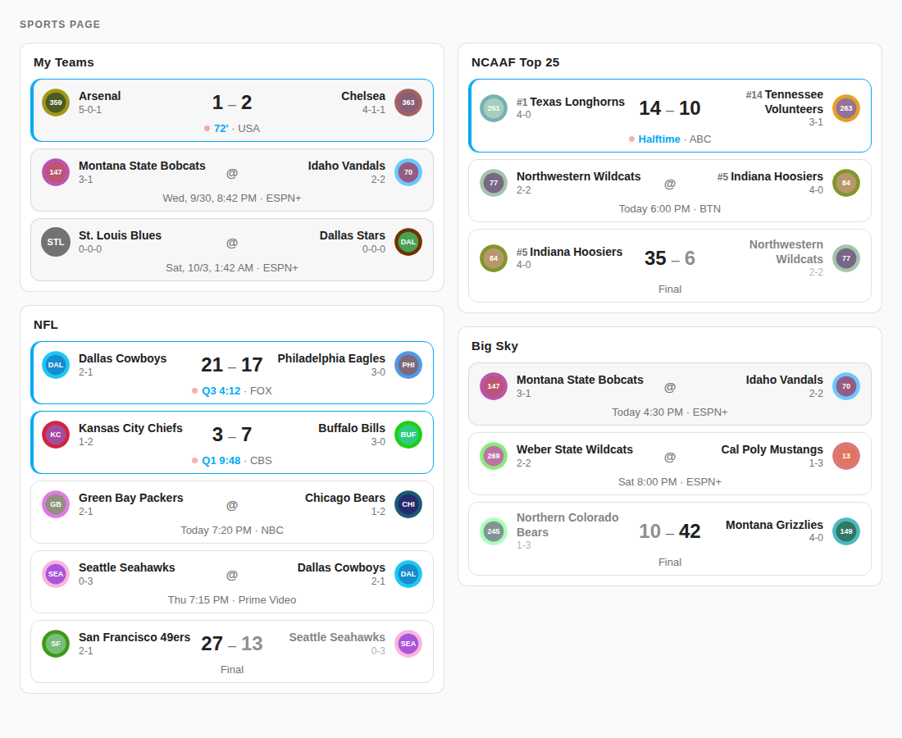

# League Scoreboard Card

A Home Assistant dashboard card that shows **whole-league scoreboards** (every NFL game this week, the college Top 25, a conference…) alongside the teams you follow with [Team Tracker](https://github.com/vasqued2/ha-teamtracker), styled like Team Tracker cards.

- **Full mode:** one tile per game: away logo + name, score, home name + logo on one line, with the clock, kickoff time or "Final" underneath. Live games are highlighted; on finished games the losing side is dimmed.
- **Compact mode:** live games and today's games only, abbreviations, a row limit, and the whole card can be tapped to open a full page.
- Uses your theme's colors, so it matches whatever theme your dashboard is using.



<sub>Screenshots use placeholder logos; on your dashboard you'll see the real team logos from ESPN.</sub>

## How it gets its data

Team Tracker follows one team per sensor, so it can't list a whole league. This card reads small **scoreboard sensors** you create with Home Assistant's built-in `rest_command` and `template` integrations, from ESPN's public scoreboard feed. Everything you need is in [`examples/`](examples/):

| File | Goes in your config folder as | What it does |
|---|---|---|
| [`configuration.yaml`](examples/configuration.yaml) | lines added to `configuration.yaml` | the ESPN request, the template include, and keeping the big game lists out of history |
| [`espn.jinja`](examples/espn.jinja) | `custom_templates/espn.jinja` | turns ESPN's huge response into a short list of games |
| [`templates.yaml`](examples/templates.yaml) | `templates.yaml` | three sensors (NFL, NCAAF Top 25, Big Sky) refreshed every 5 minutes |
| [`dashboard.yaml`](examples/dashboard.yaml) | your dashboard YAML | a compact card for the main view and a full Sports page |

After adding them: check the configuration (Cmd/Ctrl+K → "check configuration"), restart Home Assistant, and confirm `sensor.nfl_scoreboard` (etc.) has a `games` attribute under Developer Tools → States.

**Other leagues:** add another `rest_command.espn_scoreboard` call and sensor in `templates.yaml` with a different `path`, e.g. `basketball/nba/scoreboard`, `hockey/nhl/scoreboard`, `soccer/eng.1/scoreboard`, or `football/college-football/scoreboard?groups=<conference id>`.

> ESPN's feed is public but unofficial and can change without notice. If the league lists stop updating, check the ESPN request first.

## Install

### HACS (recommended)

1. HACS → ⋮ (top right) → **Custom repositories**.
2. Repository: this repo's URL. Type: **Dashboard**. Add.
3. Search **League Scoreboard Card** in HACS → Download.
4. Hard-refresh the browser (Cmd/Ctrl+Shift+R). On an iPad, close and reopen the page.

### Manual

1. Copy `league-scoreboard-card.js` to `config/www/league-scoreboard-card.js`.
2. Settings → Dashboards → ⋮ → **Resources** → Add resource: URL `/local/league-scoreboard-card.js`, type **JavaScript module**.
3. Hard-refresh the browser.

## Configuration

```yaml
type: custom:league-scoreboard-card
entity: sensor.nfl_scoreboard
```

| Option | Default | Description |
|---|---|---|
| `entity` | — | One scoreboard sensor. |
| `entities` | — | Several scoreboard sensors. Each item is an entity ID or `{entity, label}`; `label` is the short tag shown in compact mode (e.g. `NFL`). |
| `teams` | — | Team Tracker sensors. Shown first; games already listed here are dropped from the league lists so nothing appears twice. |
| `mode` | `full` | `full` or `compact`. |
| `title` | none | Card title. |
| `filter` | `all` (full), `today` (compact) | `today` = live games plus games on today's date. |
| `max` | `0` (full, no limit), `5` (compact) | Maximum games shown; the rest become "+N more". |
| `names` | `full` (full), `abbr` (compact) | `full` ("Dallas Cowboys"), `short` ("Cowboys") or `abbr` ("DAL"). |
| `favorites` | `[]` | Team abbreviations to highlight in league lists, e.g. `[MTST]`. |
| `show_records` | `true` | Win–loss records under team names (full mode). |
| `show_tv` | `true` | TV network next to the status for upcoming and live games. |
| `show_league_labels` | auto | Group headings in full mode when the card mixes several sources. |
| `empty_text` | built-in | Text when there are no games to show. |
| `style` | `default` | `counter` draws plain rows with FINAL / live / kick-off tags, matching the Counter Panel design (defaults `names` to `short`). |
| `embedded` | `false` | `true` drops the card background, border and padding, for use inside another card (Counter Panel's weather card uses this). |
| `tap_action` | none | `{action: navigate, navigation_path: /dashboard/view}`, `{action: more-info}` or `{action: url, url_path: https://…}`. Makes the whole card tappable. |

### Compact card that opens a Sports page

```yaml
type: custom:league-scoreboard-card
mode: compact
title: Sports
teams: [sensor.chelsea, sensor.montana_state, sensor.dallas_stars]
entities:
  - { entity: sensor.nfl_scoreboard, label: NFL }
  - { entity: sensor.ncaaf_top_25, label: CFB }
  - { entity: sensor.big_sky_football, label: BSKY }
tap_action:
  action: navigate
  navigation_path: /dashboard-kitchen/sports
```



### Full league list

```yaml
type: custom:league-scoreboard-card
title: Big Sky
entity: sensor.big_sky_football
favorites: [MTST]
```



## Data format

The card reads a `games` list from each scoreboard sensor. Each game is a mapping like the one `examples/espn.jinja` produces:

```yaml
state: in            # pre | in | post
detail: Q3 4:12      # clock, kickoff time or "Final"
date: 2026-09-28T17:00Z
tv: FOX
away_abbr: DAL       # also home_*
away_full: Dallas Cowboys
away_short: Cowboys
away_rank: null      # 1–25 for ranked college teams
away_logo: https://…
away_color: 002a5c
away_record: 2-1
away_score: "21"
```

Older lists that only have `away`, `home`, `away_name`, `away_logo` and the scores still work.

## Licence

MIT
